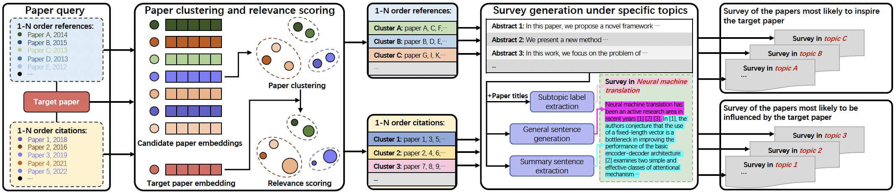

# IdeaReader

**A machine reading system for understanding the idea flow of scientific publications**

<div align=center></div>

**Python version**: This code is in Python3.7

**Package Requirements**:
```
networkx==2.4
requests==2.22.0
tqdm==4.40.2
pymongo==3.9.0
node2vec==0.3.1
nltk==3.4.5
numpy==1.17.4
pyssdb==0.4.2
torch==1.2.0
retry==0.9.2
scipy==1.3.2
pick==0.6.7
scikit_learn==0.22.1
sentence_transformers==0.2.5
mysql-connector==2.2.9
```
### Before running the code
* Download [bert-base-nli-stsb-mean-tokens](https://public.ukp.informatik.tu-darmstadt.de/reimers/sentence-transformers/v0.2/bert-base-nli-stsb-mean-tokens.zip) and copy to `models/torch/sentence_transformers/public.ukp.informatik.tu-darmstadt.de_reimers_sentence-transformers_v0.2_bert-base-nli-stsb-mean-tokens.zip`.
* Need to download `stopwords`, `wordnet`, `punkt` etc. for NLTK.
* All datasets and trained models can be downloaded from [here](https://drive.google.com/file/d/1LKK3sK_BrhWZLMr8hiw7uMvMHvXcmH1h/view?usp=sharing).
### Step1: Paper clustering and relevance scoring
#### Note:
* To run the code, you need to access the [Acemap database](www.acemap.info). you can contact us (liqilcn艾特sjtu.edu.cn).
* The reference count and citation count of the target paper must be greater than 10.
* This part of code can work on RTX2080Ti.


#### Run

1. Modify `src/input.json` as required

   | key            | value                            | remark                                                                                  |
   |----------------------------------|-----------------------------------------------------------------------------------------| ------------------------------------------------ |
   | pub_ids      | paper_id list                    | -                                                                                       |
   | mrt_type     | "tracing", "evolution" or "both" | "tracing": process reference papers, "evolution": process citation papers, "both": both |
   | verbosity    | "INFO", "WARNING" e.g.           | _                                                                                       |
   | run_parallel | 0 or 1                           | 0: single thread serial execution，1：Multithreading                                      |
   | workers      | positive integer                 | number of threads (only valid when run_parallel is 1)                                   |
   | device       | "cpu"、"cuda:0" e.g.              | cuda device                                                                             |

2. Get results
```
cd src
python generate_mrt_json_for_text_generation.py
```
* The code also has two optional parameters, which do not need to be specified except in special cases.

   | args            | default                            | remark             |
   |------------------------------------|--------------------| ------------------------------ |
   | --input_path | "./input.json"                     | path to input.json |
   | --output_dir | "../tracing_evolution_tree_jsons/" | output directory   |

### Step2: Survey generation under specific topics
* You can train and evaluate the automatic survey generation model in [model_training](./model_training).

Get results
```
cd src
python get_machine_reading_json.py
```